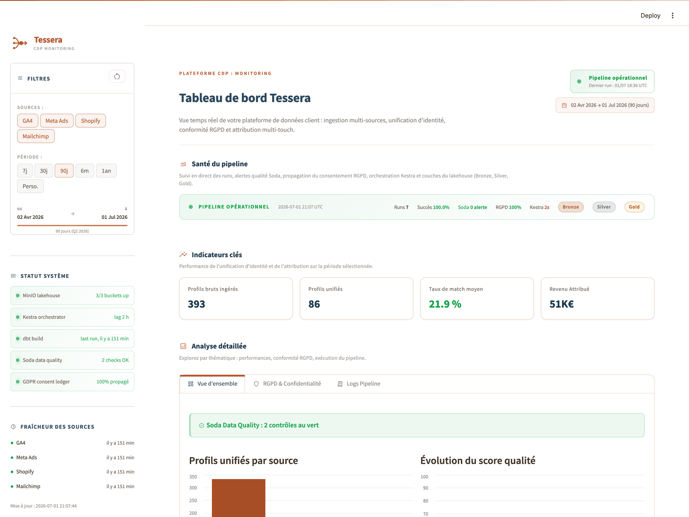
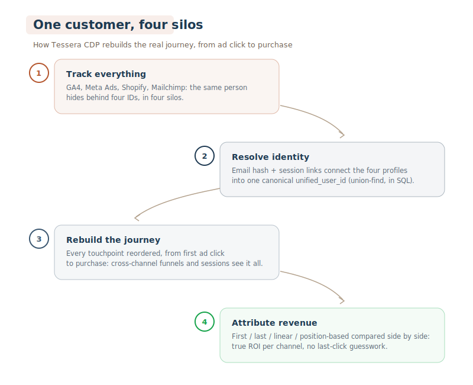
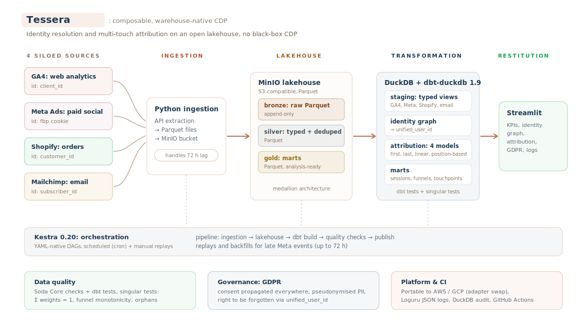
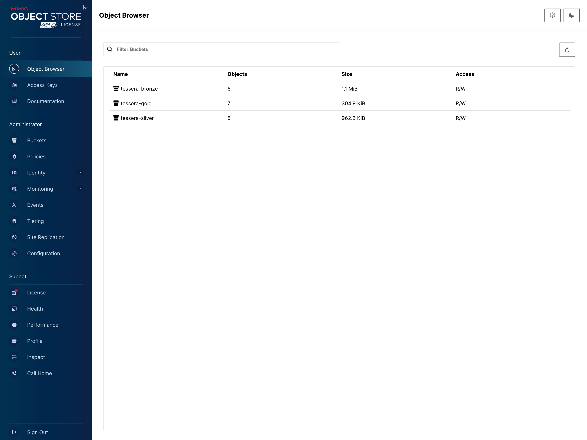
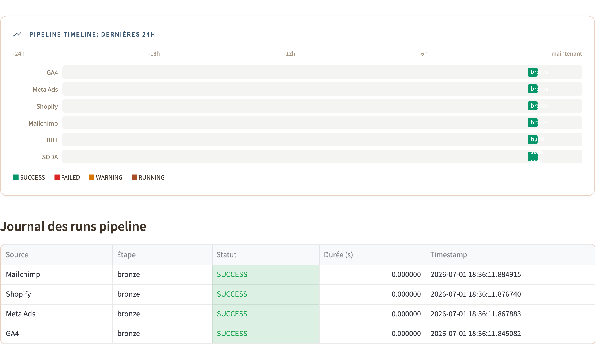

<div align="center">

# Tessera CDP

**Warehouse-native customer journey unification pipeline**\
A Composable CDP built with dbt, DuckDB, and a Parquet lakehouse on MinIO.


[](https://www.python.org/)
[](LICENSE)
[](.github/workflows/ci.yml)

[](https://www.getdbt.com/)
[](https://duckdb.org/)
[](https://parquet.apache.org/)
[](https://min.io/)
[](https://kestra.io/)
[](https://streamlit.io/)
[](https://www.soda.io/)

[Français](README.md) - **English**

</div>

---

<div align="center">
  
</div>

Tessera CDP ingests customer interactions from four disconnected marketing tools (GA4, Meta Ads, Shopify, Email), resolves identities across devices and sessions through a deterministic and probabilistic identity graph, and produces unified analytics: multi-touch attribution, cross-channel funnel analysis, and reconstructed customer journeys.

*Portfolio project: an end-to-end Composable CDP. The stack deliberately covers every lakehouse layer to demonstrate the full data chain, from ingestion to serving.*

---

## Table of Contents

- [Problem Statement](#problem-statement)
- [Tech Stack](#tech-stack)
- [Architecture](#architecture)
- [Key Features](#key-features)
- [Benchmarks](#benchmarks)
- [Quick Start](#quick-start)
- [Project Structure](#project-structure)
- [Documentation](#documentation)
- [Roadmap](#roadmap)

---

## Problem Statement

A typical mid-market e-commerce company runs GA4 for web analytics, Meta Ads for paid social, Shopify for orders, and Mailchimp for email campaigns. Each tool maintains its own user identifier (`client_id`, `fbp` cookie, `customer_id`, `subscriber_id`), so the same person exists as four disconnected profiles across four silos. This makes it impossible to reconstruct the real journey from ad-click to purchase, and attribution becomes guesswork.

Tessera CDP addresses this problem with a warehouse-native **identity graph**: raw events land in a lakehouse, deterministic and probabilistic matching stitch identities into a canonical `unified_user_id`, the full journey is reconstructed per user, and four attribution models are exposed side-by-side for comparison.

<div align="center">
  
</div>

### Context

The Composable CDP is the dominant architecture pattern for 2024-2026 (Hightouch, Census, Snowflake, BigQuery). Companies are moving identity resolution and audience building inside their own warehouse to replace $100-500k/year black-box CDPs. The death of third-party cookies (Chrome 2025-2026) and iOS 14.5 ATT have accelerated the shift to first-party, server-side identity resolution.

---

## Tech Stack

| Layer | Technology | Managed cloud equivalent |
| ----- | ---------- | ------------------------ |
| Ingestion | Python + public APIs (GA4, Meta, Shopify) | AWS Glue / Fivetran / Airbyte |
| Object storage | **MinIO** (S3-compatible, self-hosted) | AWS S3 / GCS / Azure Blob |
| Storage format | **Parquet** (partitioned, on MinIO) | Parquet on S3 / GCS / ADLS |
| Query engine | **DuckDB** 1.0 (columnar OLAP, in-process) | Snowflake / BigQuery / Redshift / Athena |
| Transformation | **dbt-duckdb** 1.9 | dbt-snowflake / dbt-bigquery (same dbt) |
| Orchestration | **Kestra** 0.20 (YAML-native) | AWS MWAA / Cloud Composer / Prefect Cloud |
| Data quality | **Soda Core** + dbt tests | Monte Carlo / Great Expectations |
| Dashboard | **Streamlit** 1.40, CDP monitoring (KPIs, GDPR, pipeline logs) | Looker / Metabase / Superset |
| Observability | **Loguru** (JSON logs) + DuckDB audit table | CloudWatch Logs / Datadog |
| CI/CD | GitHub Actions | CircleCI / GitLab CI |

Every tool above is the open-source drop-in for a managed cloud service. The code in this repo ports directly to AWS (`Glue + S3 + Athena + MWAA`) or GCP (`BigLake + BigQuery + Cloud Composer`) with config-only changes: the Python is unchanged and dbt swaps via adapter. See [`docs/architecture.md`](docs/architecture.md) for the cloud-deployment mapping.

---

## Architecture

<div align="center">
  
</div>

<details>
<summary>Text version</summary>

```
               +----- Data Sources ------+
               |  GA4 / Meta / Shopify   |
               |  Email (Mailchimp)      |
               +----------+--------------+
                          |
                          v
               +----------+--------------+
               |  Ingestion (Python)     |   orchestrated by Kestra
               |  → Parquet → MinIO      |
               +----------+--------------+
                          |
     +--------------------+--------------------+
     |  Lakehouse (MinIO / S3-compatible)      |
     |                                         |
     |  bronze/  raw Parquet, append-only      |
     |  silver/  typed + deduped, Parquet      |
     |  gold/    marts, Parquet                |
     +--------------------+--------------------+
                          |
               +----------+--------------+
               |  DuckDB + dbt-duckdb    |
               |                         |
               |  staging   → views      |
               |  intermediate → identity|
               |    graph, attribution   |
               |  marts → DuckDB tables  |
               +----------+--------------+
                          |
               +----------+--------------+
               |  Soda Core (quality)    |
               +----------+--------------+
                          |
               +----------+--------------+
               |  Streamlit (dashboard)  |
               |  KPIs / GDPR / Logs     |
               +--------------------------+
```

</details>

---

## Key Features

### Identity Resolution

Deterministic matching (email hash, logged-in `user_id`) combined with session-anchor matching (shared `client_id` across sessions with a known user) to produce a canonical `unified_user_id` via union-find in SQL. See [`dbt/models/intermediate/int_identity__graph.sql`](dbt/models/intermediate/int_identity__graph.sql) and [`docs/identity_resolution.md`](docs/identity_resolution.md).

<div align="center">
  
</div>

### Multi-Touch Attribution

Four models implemented as separate intermediate dbt models (first-touch, last-touch, linear, position-based 40/20/40), joined on the fact table for direct comparison. A custom dbt test ensures `SUM(weights) = 1.0` per conversion. See [`docs/attribution_models.md`](docs/attribution_models.md).

<div align="center">
  
</div>

### Lakehouse Pattern

Bronze / silver / gold medallion architecture in **Parquet** on S3-compatible object storage (MinIO). Bronze keeps raw Parquet partitioned by date; silver (typed / cleaned) and gold (star-schema marts) are written as Parquet by dbt, with DuckDB as the in-process query engine.

<div align="center">
  
</div>

### Data Quality

Soda Core checks + dbt tests + custom singular tests (attribution weight reconciliation, funnel monotonic decay, identity graph orphan detection).

<div align="center">
  
</div>

### GDPR Compliance

Consent status propagated through all layers, PII pseudonymisation (SHA-256 hashing), and right-to-be-forgotten: `forget.py` resolves the user via the identity graph, deletes them from the warehouse marts, and writes an audit tombstone. See [`docs/governance_gdpr.md`](docs/governance_gdpr.md).

<div align="center">
  
</div>

### SCD Type 2

`dim_users` historises identity graph changes over time (email updates, device fingerprint evolution) with valid-from / valid-to tracking.

---

## Benchmarks

```bash
make benchmark         # full pipeline (seed + ingest + transform + quality)
make benchmark-quick   # without the Soda checks
```

Per-step timings are printed at the end of the run (`scripts/benchmark.py`).

---

## Quick Start

```bash
make install      # venv, deps, dbt/profiles.yml
make up            # MinIO + Streamlit (make up-full adds Kestra)
make pipeline      # seed, ingest, dbt, quality
open http://localhost:8501
```

### Day-to-day

The warehouse and buckets persist between sessions: when you come back, **`make up` is enough** and the dashboard shows the last known state. To regenerate fresh data, always start from a clean slate:

```bash
make nuke && make up && make pipeline   # reset volumes + full run
```

(Bronze is append-only: re-running the pipeline on another day without `nuke` would stack both days of synthetic data.)

Once running, the MinIO console is at `http://localhost:9001` (minioadmin / minioadmin), the Kestra UI at `http://localhost:8080`, and the Streamlit dashboard at `http://localhost:8501`. Teardown with `make nuke` (removes all volumes).

---

## Project Structure

```
tessera/
├── ingestion/                    # Python extractors, Parquet to MinIO (GA4, Meta, Shopify, Email)
├── seed/                         # Synthetic data generator (offline fallback)
├── dbt/                          # Transformation layer (staging, intermediate, marts)
│   ├── models/staging/           #   1 view per source, typed + renamed
│   ├── models/intermediate/      #   Identity graph, sessions, attribution
│   ├── models/marts/             #   dim_users (SCD2), fct_*, star schema
│   └── tests/                    #   Custom singular tests
├── orchestration/flows/          # Kestra YAML workflows (ingest, transform, quality)
├── quality/soda/                 # Soda Core checks (gold-layer contracts)
├── app.py                        # Streamlit dashboard entrypoint
├── app/lib/                      # Dashboard shared lib (db.py, queries.py)
├── tests/                        # Unit + integration tests (pytest)
├── scripts/                      # Utilities (benchmark runner)
├── docs/                         # Technical documentation
├── docker-compose.yml            # Local stack (MinIO + Kestra + Streamlit)
├── Makefile                      # CLI entrypoint (make help)
└── .github/workflows/ci.yml      # GitHub Actions CI
```

---

## Documentation

The `docs/` directory documents each aspect of the project in depth.

| Document | Contents |
| -------- | -------- |
| [`architecture.md`](docs/architecture.md) | Bronze/silver/gold layers and cloud deployment mapping. |
| [`identity_resolution.md`](docs/identity_resolution.md) | Matching rules and union-find algorithm. |
| [`attribution_models.md`](docs/attribution_models.md) | The four attribution models, their SQL and trade-offs. |
| [`data_sources.md`](docs/data_sources.md) | Source APIs and fallback strategy. |
| [`governance_gdpr.md`](docs/governance_gdpr.md) | Consent propagation and pseudonymisation. |
| [`observability.md`](docs/observability.md) | Structured logging and CloudWatch wiring. |

---

## Roadmap

- Migrate storage to Apache Iceberg (transactional cross-layer DELETE, time-travel, schema evolution)
- Reverse ETL layer (push unified audiences to Meta Custom Audiences, Mailchimp segments)
- Streaming ingestion via Redpanda for near-real-time events
- Package the identity graph as a publishable dbt package

---

<div align="center">

**Tessera CDP**, built by **Lohana Utim**

</div>
