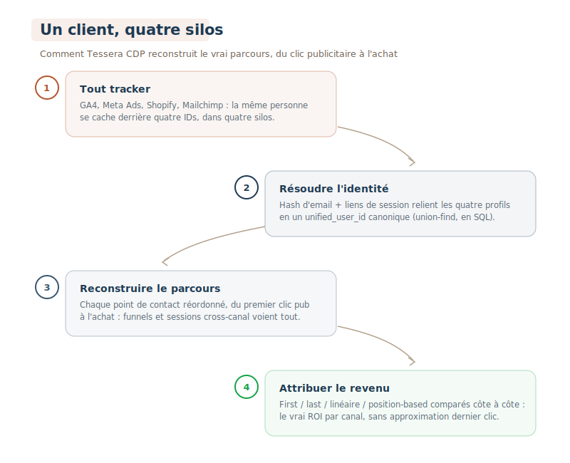
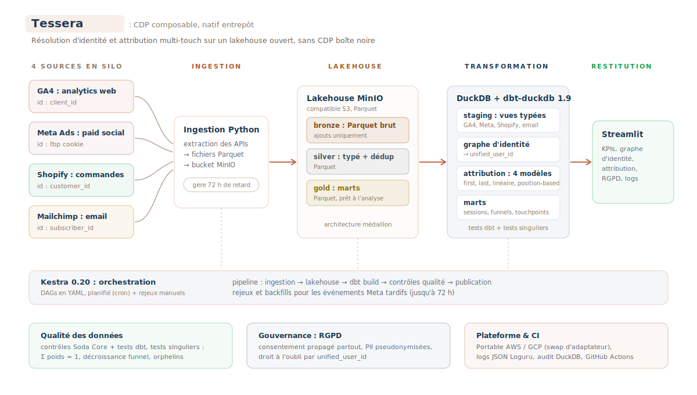

<div align="center">

# Tessera CDP

**Pipeline d'unification du parcours client, warehouse-native**\
Une CDP composable bâtie avec dbt, DuckDB et un lakehouse Parquet sur MinIO.


[](https://www.python.org/)
[](LICENSE)
[](.github/workflows/ci.yml)

[](https://www.getdbt.com/)
[](https://duckdb.org/)
[](https://parquet.apache.org/)
[](https://min.io/)
[](https://kestra.io/)
[](https://streamlit.io/)
[](https://www.soda.io/)

**Français** - [English](README.en.md)

</div>

---

<div align="center">
  
</div>

Tessera CDP ingère les interactions clients depuis quatre outils marketing déconnectés (GA4, Meta Ads, Shopify, Email), résout les identités entre devices et sessions via un graphe d'identité déterministe et probabiliste, et expose une analytique unifiée : attribution multi-touch, analyse de funnel cross-channel et parcours client reconstruit.

*Projet portfolio : une CDP composable de bout en bout. La stack couvre volontairement chaque couche du lakehouse pour démontrer la chaîne data complète, de l'ingestion à la restitution.*

---

## Sommaire

- [Le problème](#le-problème)
- [Stack](#stack)
- [Architecture](#architecture)
- [Fonctionnalités clés](#fonctionnalités-clés)
- [Benchmarks](#benchmarks)
- [Démarrage rapide](#démarrage-rapide)
- [Structure du projet](#structure-du-projet)
- [Documentation](#documentation)
- [Feuille de route](#feuille-de-route)

---

## Le problème

Une entreprise e-commerce mid-market type utilise GA4 pour le web analytics, Meta Ads pour le social payant, Shopify pour les commandes et Mailchimp pour l'email. Chaque outil maintient son propre identifiant utilisateur (`client_id`, cookie `fbp`, `customer_id`, `subscriber_id`), si bien que la même personne existe comme quatre profils déconnectés dans quatre silos. Impossible alors de reconstruire le parcours réel du clic publicitaire à l'achat, et l'attribution devient de la devinette.

Tessera CDP répond à ce problème avec un **graphe d'identité warehouse-native** : les événements bruts atterrissent dans un lakehouse, un matching déterministe et probabiliste rapproche les identités en un `unified_user_id` canonique, le parcours complet est reconstruit par utilisateur, et quatre modèles d'attribution sont exposés côte à côte pour comparaison.

<div align="center">
  
</div>

### Contexte

La Composable CDP est le pattern d'architecture dominant pour 2024-2026 (Hightouch, Census, Snowflake, BigQuery). Les entreprises déplacent la résolution d'identité et la construction d'audiences dans leur propre warehouse pour remplacer des CDP boîte noire à 100-500 k$/an. La mort des cookies tiers (Chrome 2025-2026) et l'App Tracking Transparency d'iOS 14.5 ont accéléré le passage à une résolution d'identité first-party, côté serveur.

---

## Stack

| Couche | Technologie | Équivalent cloud managé |
| ------ | ----------- | ----------------------- |
| Ingestion | Python + APIs publiques (GA4, Meta, Shopify) | AWS Glue / Fivetran / Airbyte |
| Stockage objet | **MinIO** (S3-compatible, self-hosted) | AWS S3 / GCS / Azure Blob |
| Format de stockage | **Parquet** partitionné (sur MinIO) | Parquet sur S3 / GCS / ADLS |
| Moteur de requête | **DuckDB** 1.0 (OLAP columnar, in-process) | Snowflake / BigQuery / Redshift / Athena |
| Transformation | **dbt-duckdb** 1.9 | dbt-snowflake / dbt-bigquery (même dbt) |
| Orchestration | **Kestra** 0.20 (YAML-native) | AWS MWAA / Cloud Composer / Prefect Cloud |
| Qualité des données | **Soda Core** + tests dbt | Monte Carlo / Great Expectations |
| Dashboard | **Streamlit** 1.40, monitoring CDP (KPIs, RGPD, logs pipeline) | Looker / Metabase / Superset |
| Observabilité | **Loguru** (logs JSON) + table d'audit DuckDB | CloudWatch Logs / Datadog |
| CI/CD | GitHub Actions | CircleCI / GitLab CI |

Chaque outil ci-dessus est le drop-in open-source d'un service cloud managé. Le code de ce repo est directement transposable sur AWS (`Glue + S3 + Athena + MWAA`) ou GCP (`BigLake + BigQuery + Cloud Composer`) avec des changements de configuration uniquement : le Python est inchangé et dbt se swap via adapter. Voir [`docs/architecture.md`](docs/architecture.md) pour le mapping de déploiement cloud.

---

## Architecture

<div align="center">
  
</div>

<details>
<summary>Version texte</summary>

```
               +----- Data Sources ------+
               |  GA4 / Meta / Shopify   |
               |  Email (Mailchimp)      |
               +----------+--------------+
                          |
                          v
               +----------+--------------+
               |  Ingestion (Python)     |   orchestrée par Kestra
               |  → Parquet → MinIO      |
               +----------+--------------+
                          |
     +--------------------+--------------------+
     |  Lakehouse (MinIO / S3-compatible)      |
     |                                         |
     |  bronze/  Parquet brut, append-only     |
     |  silver/  typé + dédupé, Parquet        |
     |  gold/    marts, Parquet                |
     +--------------------+--------------------+
                          |
               +----------+--------------+
               |  DuckDB + dbt-duckdb    |
               |                         |
               |  staging   → vues       |
               |  intermediate → identité|
               |    graphe, attribution  |
               |  marts → tables DuckDB  |
               +----------+--------------+
                          |
               +----------+--------------+
               |  Soda Core (qualité)    |
               +----------+--------------+
                          |
               +----------+--------------+
               |  Streamlit (dashboard)  |
               |  KPIs / RGPD / Logs     |
               +--------------------------+
```

</details>

---

## Fonctionnalités clés

### Résolution d'identité

Matching déterministe (email hash, `user_id` loggé) combiné à un matching par ancre de session (même `client_id` partagé entre sessions avec un utilisateur connu) pour produire un `unified_user_id` canonique via un union-find implémenté en SQL. Voir [`dbt/models/intermediate/int_identity__graph.sql`](dbt/models/intermediate/int_identity__graph.sql) et [`docs/identity_resolution.md`](docs/identity_resolution.md).

<div align="center">
  
</div>

### Attribution multi-touch

Quatre modèles implémentés comme modèles intermediate dbt séparés (first-touch, last-touch, linéaire, position-based 40/20/40), joints sur la fact table pour comparaison directe. Un test dbt custom garantit `SUM(weights) = 1.0` par conversion. Voir [`docs/attribution_models.md`](docs/attribution_models.md).

<div align="center">
  
</div>

### Pattern lakehouse

Architecture médaillon bronze / silver / gold en **Parquet** sur stockage objet S3-compatible (MinIO). Bronze conserve le Parquet brut partitionné par date ; silver (typé / nettoyé) et gold (marts en étoile) sont écrits en Parquet par dbt, DuckDB servant de moteur de requête in-process.

<div align="center">
  
</div>

### Qualité des données

Checks Soda Core + tests dbt + tests singuliers custom (réconciliation des poids d'attribution, décroissance monotone du funnel, détection des orphelins du graphe d'identité).

<div align="center">
  
</div>

### Conformité RGPD

Statut de consentement propagé dans toutes les couches, pseudonymisation des PII (hash SHA-256), et droit à l'oubli : `forget.py` résout l'utilisateur via le graphe d'identité, le supprime des marts du warehouse, puis écrit un tombstone d'audit. Voir [`docs/governance_gdpr.md`](docs/governance_gdpr.md).

<div align="center">
  
</div>

### SCD Type 2

`dim_users` historise les évolutions du graphe d'identité dans le temps (changements d'email, évolution des empreintes device) avec un suivi valid-from / valid-to.

---

## Benchmarks

```bash
make benchmark         # pipeline complète (seed + ingest + transform + quality)
make benchmark-quick   # sans les checks Soda
```

Les timings de chaque étape s'affichent en fin de run (`scripts/benchmark.py`).

---

## Démarrage rapide

```bash
make install      # venv, dépendances, dbt/profiles.yml
make up            # MinIO + Streamlit (make up-full ajoute Kestra)
make pipeline      # seed, ingest, dbt, quality
open http://localhost:8501
```

### Reprise au quotidien

Le warehouse et les buckets persistent entre les sessions : au retour sur le projet, **`make up` suffit** et le dashboard ré-affiche le dernier état. Pour régénérer des données fraîches, toujours repartir d'un état propre :

```bash
make nuke && make up && make pipeline   # reset volumes + run complet
```

(Le bronze est append-only : relancer le pipeline un autre jour sans `nuke` empilerait les données synthétiques des deux journées.)

Une fois lancé, la console MinIO est sur `http://localhost:9001` (minioadmin / minioadmin), l'UI Kestra sur `http://localhost:8080`, et le dashboard Streamlit sur `http://localhost:8501`. Pour tout arrêter : `make nuke` (supprime les volumes).

---

## Structure du projet

```
tessera/
├── ingestion/                    # extracteurs Python, Parquet vers MinIO (GA4, Meta, Shopify, Email)
├── seed/                         # générateur de données synthétiques (fallback offline)
├── dbt/                          # couche de transformation (staging, intermediate, marts)
│   ├── models/staging/           #   1 vue par source, typée + renommée
│   ├── models/intermediate/      #   graphe d'identité, sessions, attribution
│   ├── models/marts/             #   dim_users (SCD2), fct_*, schéma en étoile
│   └── tests/                    #   tests singuliers custom
├── orchestration/flows/          # workflows Kestra YAML (ingest, transform, quality)
├── quality/soda/                 # checks Soda Core (contrats couche gold)
├── app.py                        # point d'entrée du dashboard Streamlit
├── app/lib/                      # lib partagée du dashboard (db.py, queries.py)
├── tests/                        # tests unit + integration (pytest)
├── scripts/                      # utilitaires (runner de benchmark)
├── docs/                         # documentation technique
├── docker-compose.yml            # stack locale (MinIO + Kestra + Streamlit)
├── Makefile                      # point d'entrée CLI (make help)
└── .github/workflows/ci.yml      # CI GitHub Actions
```

---

## Documentation

Le dossier `docs/` documente chaque aspect du projet en profondeur.

| Document | Contenu |
| -------- | ------- |
| [`architecture.md`](docs/architecture.md) | Couches bronze/silver/gold et mapping de déploiement cloud. |
| [`identity_resolution.md`](docs/identity_resolution.md) | Règles de matching et algorithme union-find. |
| [`attribution_models.md`](docs/attribution_models.md) | Les quatre modèles d'attribution, leur SQL et leurs compromis. |
| [`data_sources.md`](docs/data_sources.md) | APIs des sources et stratégie de fallback. |
| [`governance_gdpr.md`](docs/governance_gdpr.md) | Propagation du consentement et pseudonymisation. |
| [`observability.md`](docs/observability.md) | Logging structuré et câblage CloudWatch. |

---

## Feuille de route

- Migration du stockage vers Apache Iceberg (DELETE transactionnel cross-couche, time-travel, évolution de schéma)
- Couche reverse ETL (pousser les audiences unifiées vers Meta Custom Audiences, segments Mailchimp)
- Ingestion streaming via Redpanda pour des événements near-real-time
- Packager le graphe d'identité comme un package dbt publiable

---

<div align="center">

**Tessera CDP**, réalisé par **Lohana Utim**

</div>
