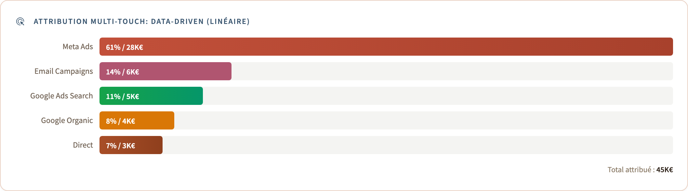

# Modèles d'attribution multi-touch

Une fois les identités résolues : *"Marie a converti après 4 points de contact
répartis sur 4 canaux : comment répartir le crédit ?"* Aucune réponse unique
n'est correcte, c'est pourquoi quatre modèles standards s'exécutent côte à côte
sur les mêmes données.

<div align="center">
  
</div>

---

## 1. Les quatre modèles

| Modèle | Crédit | Cas d'usage |
| ------ | ------ | ----------- |
| **First-touch** | 100 % au premier point de contact | découverte / haut de l'entonnoir |
| **Last-touch** | 100 % au dernier point de contact | canal de clôture / ROAS |
| **Linéaire** | 1/N à chaque point de contact | choix par défaut équilibré |
| **Basé sur la position** (40/20/40) | 40 % au premier, 40 % au dernier, 20 % partagés par les intermédiaires | découverte + clôture combinées |

## 2. Même parcours, quatre réponses

La commande de 180 € de Marie : publicité Instagram, recherche Google, blog
organique, e-mail, achat.

| Modèle          | paid_social | paid_search | organic_search | email |
| --------------- | ----------- | ----------- | -------------- | ----- |
| First-touch     | 180 €       | 0 €         | 0 €            | 0 €   |
| Last-touch      | 0 €         | 0 €         | 0 €            | 180 € |
| Linéaire        | 45 €        | 45 €        | 45 €           | 45 €  |
| Basé sur la position | 72 €   | 18 €        | 18 €           | 72 €  |

Le choix du modèle change radicalement la conclusion, ce qui est précisément la
raison pour laquelle les quatre sont exposés ensemble plutôt que d'en figer un
seul comme le font GA4 ou Meta.

## 3. Implémentation

Les quatre modèles se trouvent dans
[`dbt/models/intermediate/int_touchpoints__attribution.sql`](../dbt/models/intermediate/int_touchpoints__attribution.sql),
partageant la même entrée (`int_touchpoints__enriched` : points de contact
annotés de `unified_user_id`, `channel`, `ts`, et d'un `conversion_id` lorsqu'ils
sont dans la fenêtre d'attribution) et le même schéma de sortie
`(conversion_id, touchpoint_id, channel, attribution_model, weight)`.

First / last / linéaire correspondent chacun à une fonction de fenêtrage. Le
modèle basé sur la position est le seul non trivial :

```sql
CASE
    WHEN n = 1                    THEN 1.0
    WHEN n = 2                    THEN 0.5
    WHEN rn_asc = 1 OR rn_asc = n THEN 0.4
    ELSE                               0.2 / (n - 2)
END AS weight
```

`fct_conversions` expose ensuite les quatre modèles sur la même ligne de faits,
de sorte qu'un seul `GROUP BY channel` répond à n'importe quelle question
d'attribution : cette requête alimente le panneau d'attribution du tableau de
bord.

## 4. L'invariant : la somme des poids vaut 1

Pour chaque conversion et chaque modèle, `SUM(weight) = 1.0`. Vérifié au moment
de la construction par
[`dbt/tests/assert_attribution_weights_sum_to_one.sql`](../dbt/tests/assert_attribution_weights_sum_to_one.sql):

```sql
SELECT conversion_id, attribution_model, SUM(weight) AS total_weight
FROM {{ ref('int_touchpoints__attribution') }}
GROUP BY conversion_id, attribution_model
HAVING ABS(SUM(weight) - 1.0) > 0.001
```

S'il se déclenche, c'est qu'une jointure a dupliqué des lignes ou que le calcul
basé sur la position a perdu des centimes.

## 5. Réglages

- **Fenêtre d'attribution** : 30 jours par défaut
  (`vars: attribution_window_days` dans `dbt_project.yml`). SaaS : 90-180 j,
  ventes flash : 1-7 j.
- **Décroissance temporelle** : non implémentée (les quatre modèles pondèrent la
  fenêtre uniformément) ; une variante à décroissance figure dans la feuille de
  route du README.
- **Organique/direct** : traités comme de vrais canaux ; `dim_channels.is_paid`
  fait de leur filtrage un choix métier tenant sur une ligne.

---

*Suite :* [`data_sources.md`](data_sources.md)
