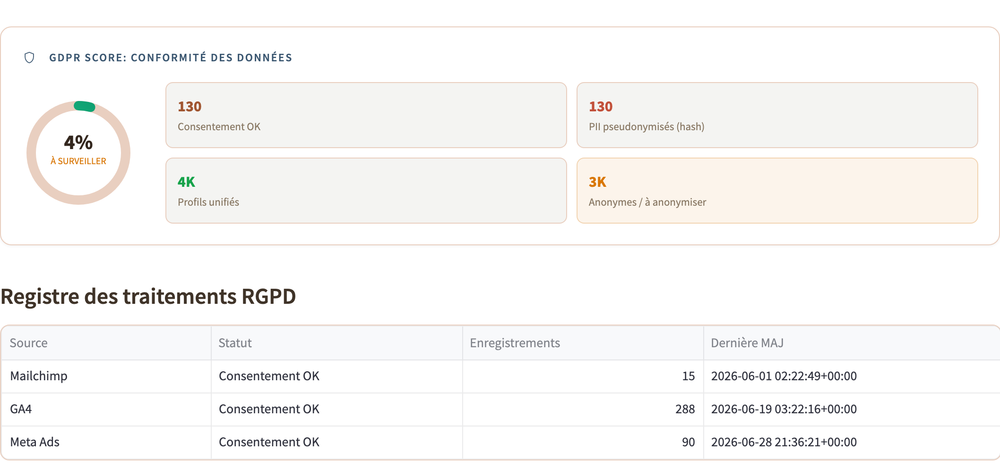

# Gouvernance : gestion RGPD / GDPR

Des patterns d'ingénierie concrets pour la conformité RGPD (ce n'est pas un
conseil juridique).

<div align="center">
  
</div>

---

## 1. Des principes à l'ingénierie

| Principe RGPD | Implémentation |
| ------------- | -------------- |
| Base légale (consentement) | chaque événement porte un `consent_status` dès l'ingestion |
| Minimisation des données | bronze stocke tout ; silver/gold ne projettent que les champs nécessaires |
| Pseudonymisation | données personnelles directes hachées avant la couche analytique |
| Droit à l'oubli | une seule CLI supprime un utilisateur des marts de l'entrepôt + écrit une pierre tombale d'audit |

## 2. Propagation du consentement

`consent_status` ∈ `granted` / `anonymous` / `withdrawn`, provenant du mode
consentement v2 de GA4, de la charge utile du Pixel Meta,
`customer.accepts_marketing` (Shopify) et du statut d'abonnement (Email).

Chaque modèle de staging filtre :

```sql
WHERE consent_status IN ('granted', 'anonymous')
```

Les événements `withdrawn` restent uniquement en bronze : vous devez pouvoir
prouver que vous avez cessé d'utiliser les données après le retrait.

**La résolution d'identité est cadrée par le consentement** : le union-find ne
fusionne que les paires où les deux extrémités ont `consent = granted`. Un clic
GA4 anonyme n'est jamais relié à un achat Shopify avec compte connecté. La
violation RGPD la plus courante du secteur consiste à construire des profils à
partir de signaux non consentis.

## 3. Pseudonymisation

| Champ | Traitement |
| ----- | ---------- |
| `email` | `sha256(lower(trim(email)))` au staging ; l'e-mail brut n'est jamais sélectionné en aval |
| `phone` | `sha256(e164(phone))` |
| `ip_address` | tronquée en /24 (IPv4) |
| `unified_user_id`, `customer_id`, `fbp`, … | pseudo-identifiants, conservés en silver/gold |

Le hachage a lieu au **staging**, pas à l'ingestion : bronze conserve les
données personnelles brutes car une demande d'accès au titre de l'article 15
exige de reconstruire exactement ce qui a été stocké ; les hachages ne peuvent
pas être inversés. En production, bronze réside dans un bucket séparé avec
chiffrement au repos et accès restreint.

## 4. Droit à l'oubli (article 17)

Une seule opération, implémentée dans
[`ingestion/gdpr/forget.py`](../ingestion/gdpr/forget.py):

```bash
python -m ingestion.gdpr.forget --email user@example.com
```

1. Hacher l'e-mail pour trouver `unified_user_id` dans `dim_users`.
2. Résoudre chaque ligne de faits liée à cet utilisateur.
3. `DELETE` de l'utilisateur des marts de l'entrepôt (`dim_users`, `fct_touchpoints`,
   `fct_sessions`, `fct_conversions`, `fct_funnel_steps`) dans DuckDB.
4. Enregistrer une pierre tombale sans données personnelles (`forgotten_users` : `unified_user_id`, date, identifiant de demande).

> Bronze conserve les événements bruts à des fins d'audit et est purgé
> séparément par la rétention (expiration de partition, ci-dessous), pas par
> cette commande. La migration des couches vers Iceberg pour un `DELETE`
> transactionnel unique entre couches figure dans la feuille de route.

## 5. Rétention

| Source  | Rétention | Fondement |
| ------- | --------- | --------- |
| GA4     | 26 mois | valeur par défaut GA4, alignée sur la CNIL |
| Meta    | 13 mois | politique Meta, recommandation CNIL |
| Shopify | jusqu'à suppression (10 ans pour les documents fiscaux) | droit commercial + fiscal |
| Email   | désabonnement + 3 ans | LCEN française |

La rétention est appliquée en supprimant les partitions bronze antérieures aux
dates ci-dessus (la disposition en partitions en fait une suppression de
stockage objet peu coûteuse).

---

*Suite :* [`observability.md`](observability.md)
