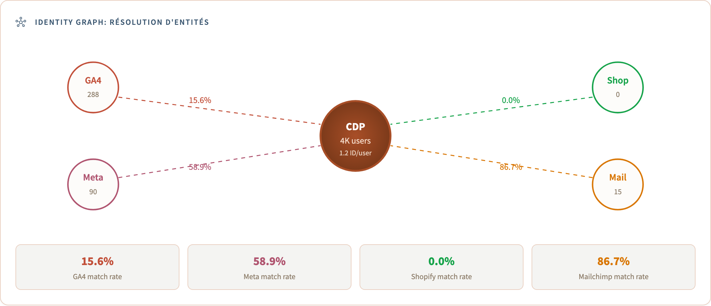

# Résolution d'identité

Le cœur technique du projet : affirmer que *"tous ces événements ont été
réalisés par la même personne"*. Implémenté dans
[`dbt/models/intermediate/int_identity__graph.sql`](../dbt/models/intermediate/int_identity__graph.sql).

<div align="center">
  
</div>

---

## 1. Entrées

| Source   | Identifiants par événement |
| -------- | -------------------------- |
| GA4      | `ga_client_id`, `ga_user_id` (seulement si le site le définit) |
| Meta Ads | cookie `fbp`, identifiant de clic `fbc`, `email_hash` (Conversion API) |
| Shopify  | `customer_id`, `email`, `phone` |
| Email    | `subscriber_id`, `email`, `device_id` |

Objectif : une table `dim_users` avec un `unified_user_id` par personne physique.

## 2. Règles de correspondance, de la plus forte à la plus faible

**Couche 1 : déterministe (≈99 % de confiance).** Même
`sha256(lower(trim(email)))` entre sources ; `ga_user_id = customer_id` ;
liens transitifs entre `subscriber_id`, `email` et `customer_id`. Résout à elle
seule 70-80 % des clients connus.

**Couche 2 : ancrage de session (fort).** Lorsqu'un utilisateur se connecte, les
événements du même `ga_client_id` / `fbp` au sein de la même session (±30 min)
appartiennent à ce `unified_user_id` : cela capture la navigation anonyme avant
la connexion, prolongée en arrière dans une fenêtre de 90 jours.

**Couche 3 : ancrage d'appareil (probabiliste, jamais fusionné automatiquement).**
Une même empreinte d'appareil suggère un même foyer, pas une même personne.
Enregistrée avec `confidence = 'probabilistic'` dans `int_identity__matches`,
mais jamais regroupée dans un `unified_user_id` sans un signal déterministe :
cela évite de fusionner deux personnes qui partagent un ordinateur portable.

## 3. Union-find en SQL

Les règles produisent des correspondances par paires ; les composantes connexes
les transforment en personnes :

```
(ga=A, shopify=100), (shopify=100, sub=S1), (fbp=F, ga=A)
Result: Person 1 = {A, F, 100, S1}
```

Le SQL pur ne possède pas de primitive union-find, aussi le modèle exécute-t-il
une propagation itérative d'étiquettes (CTE récursive, portable vers DuckDB /
Snowflake / BigQuery / Postgres) : chaque paire conserve la plus petite
étiquette, répéter jusqu'à stabilisation, généralement 3-5 itérations. La sortie
est une table de correspondance de `raw_identifier` vers `unified_user_id` sur
laquelle chaque modèle en aval effectue une jointure.

## 4. Historisation (SCD Type 2)

Les e-mails changent, les appareils sont remplacés, le consentement est retiré.
`dim_users` est un SCD2 :

```
unified_user_id | valid_from  | valid_to    | email_hash  | consent
uuid_a8b1       | 2025-01-10  | 2025-11-02  | sha(old@..) | granted
uuid_a8b1       | 2025-11-02  | 9999-12-31  | sha(new@..) | granted
```

Les faits font une jointure sur `unified_user_id` **et** l'horodatage de
l'événement tombant dans `[valid_from, valid_to)`, de sorte que les requêtes
historiques restent correctes.

## 5. Modes de défaillance

- **Fusion erronée** (trop empressée) : atténuée en ne promouvant jamais
  automatiquement les correspondances probabilistes de la couche 3.
- **Scission erronée** (trop conservatrice) : une session mobile anonyme qui ne
  se connecte jamais reste orpheline. Accepté : la résoudre nécessite un
  fournisseur d'identité payant (LiveRamp, ID5).
- **Cadre du consentement** : le union-find ne s'exécute que sur les paires où
  les deux extrémités ont `consent = granted` : aucun profil n'est jamais
  construit à partir de signaux non consentis.
  Voir [`governance_gdpr.md`](governance_gdpr.md).

---

*Suite :* [`attribution_models.md`](attribution_models.md)
